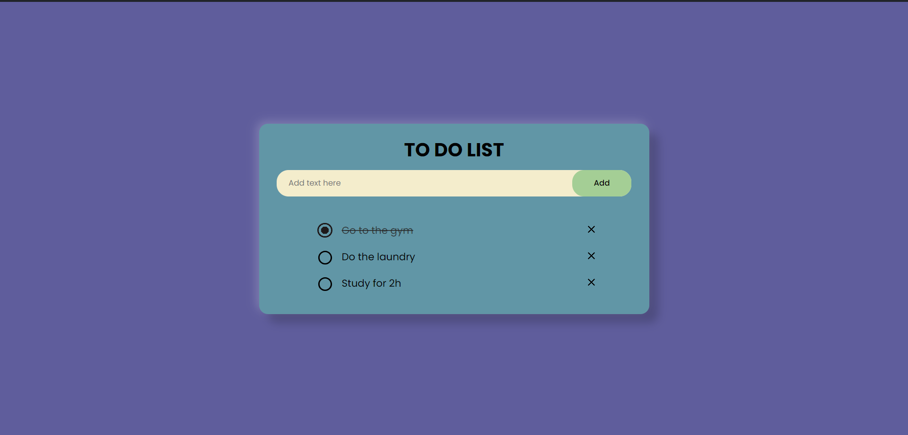

# To-Do Website

This To-Do website project was created as a part of my journey in learning JavaScript. It serves as a practical application to understand event handling and utilizing local storage in web development.

## Features

- **Add Tasks**: Easily add new tasks to your to-do list.
- **Complete Tasks**: Mark tasks as complete once you finish them.
- **Delete Tasks**: Remove tasks that you no longer need.
- **Persistent Storage**: Utilizes local storage to save your to-do list, ensuring your tasks are saved even when you close or refresh the page.

## Technologies Used

- **HTML**: Provides the structure and content of the webpage.
- **CSS**: Styles the webpage for a better user experience.
- **JavaScript**: Implements the functionality of the to-do list, including event handling and local storage management.

## Screenshots

*Overview of the website.*

*Screenshot demonstrating task completion.*

## How to Use

1. **Clone the Repository**: Clone this repository to your local machine using `git clone`.
2. **Open `index.html`**: Open the `index.html` file in your web browser.
3. **Start Adding Tasks**: Use the input field to add tasks to your to-do list.
4. **Mark Tasks as Complete**: Click on a task to mark it as complete.
5. **Delete Tasks**: Click on the delete button next to a task to remove it from the list.

## Contributing

If you'd like to contribute to this project, feel free to fork the repository and submit a pull request. Any suggestions, improvements, or bug fixes are highly appreciated!
